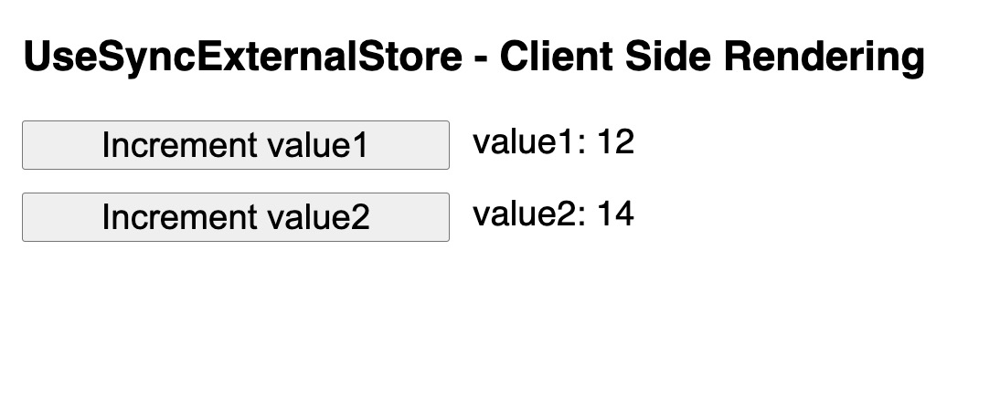

# useSyncExternalStore with Server Side Rendering App

```
useSyncExternalStore(subscribe, getSnapshot, getServerSnapshot?)
```

getServerSnapshot parameter is a function that returns the initial snapshot of the data in the store - only used during server rendering and during the hydration of server-rendered content on the client.

We need to try and route the state coming from the initial fetch of the app get server side props and propagate to the store.

```
export function getServerSideProps(){
  return {
    props: {
      initialState: {
        value1: 12,
        value2: 14
      }
    }
  }
}
```

### How do we route initial state from the app to useStoreExternalStore?

We can use context as the useStore hook access to react context.

```
const ServerContext = createContext();
```

```
<ServerContext.Provider value={initialState}>
  // Provider wraps the app so initialState is available to the useStore hook
</ServerContext.Provider>
```

```
const useStore = (selector = (state) => state) =>
  useSyncExternalStore(
    store.subscribe,
    () => selector(store.getState()),
    () => selector(useContext(ServerContext))
  );
```

### How do we initialise the store on the client side?

Create a new method on the createStore function

```
serverInitialize: (initialState) => {
      currentState = initialState;
    },
```

We can then initialize in index.js

```
store.serverInitialize(initialState)

```



If the App component (index.js) was to re-render it would re-initialize the store with the initial state. So we want to call: 
```
serverInitialize: (initialState) => {
      currentState = initialState;
    },
```

the once.

